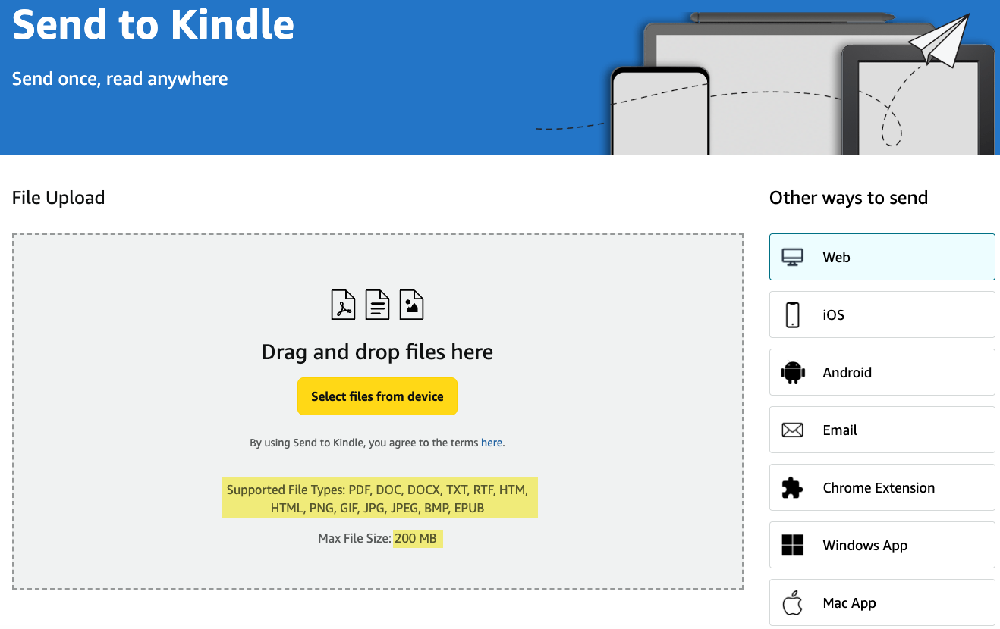

# 方序传书（Fangxu Kindle Transfer）

**简体中文** | [English](./README_EN.md)

[](https://go.dev/)
[](./LICENSE)
[](#下载)
[](#下载)
[](#下载)

> 方寸之间，自有书序。

免费、开源、无需安装的 Kindle 传书工具。在同一 Wi-Fi 下，用 Kindle 内置浏览器直接下载电子书；其他格式可在电脑端快速打开 Amazon Send to Kindle 发送。


## 下载

前往 [GitHub Releases](https://github.com/goldenwind/kindle-transfer/releases) 下载对应版本：

| 系统 | 下载文件 |
| --- | --- |
| Windows | `kindle-send-windows-amd64.exe` |
| macOS | `Fangxu-Kindle-Transfer-macOS.zip` |
| Linux x86-64 | `kindle-send-linux-amd64` |
| Linux ARM64 | `kindle-send-linux-arm64` |

## 快速上手

1. 在电脑上双击运行程序，浏览器会自动打开控制页。
2. 选择存放电子书的文件夹；不选择时默认使用“下载/Downloads”目录。
3. 让 Kindle 与电脑连接同一 Wi-Fi。
4. 在 Kindle 浏览器中打开控制页显示的局域网地址，点击书名下载。

再次双击程序会打开已运行的服务，不会重复启动。端口由系统自动选择，避免冲突。

> Windows 首次启动时，请允许防火墙访问“专用网络”。macOS 首次被拦截时，请右键 App，选择“打开”。Linux 版本首次运行前需执行 `chmod +x 文件名`。

## 支持的格式

- **Kindle 内置浏览器下载：** `AZW3`、`MOBI`、`TXT`、`AZW`、`KFX`、`PRC`
- **Send to Kindle：** `PDF`、`DOC`、`DOCX`、`TXT`、`RTF`、`HTM`、`HTML`、`PNG`、`GIF`、`JPG`、`JPEG`、`BMP`、`EPUB`，单个文件不超过 200 MB



电脑端点击文件可复制完整路径；点击“复制并打开 Send to Kindle”会复制路径并打开 [Amazon Send to Kindle](https://www.amazon.com/sendtokindle)。受浏览器安全限制，仍需在上传窗口中手动选择文件。

## 主要功能

- 自动扫描子目录，按格式筛选并显示文件数量
- 默认按修改时间倒序，也可按文件名排序
- 中文、英文界面，自动记住语言选择
- 随机空闲端口、单实例运行
- 适配 Kindle 小屏与电脑浏览器
- 局域网直传文件不经过第三方服务器

## ☕ 支持与关注

方序传书会一直保持免费、开源。如果它帮你省下了时间，欢迎请作者喝杯咖啡、给项目一个 Star，或分享给仍在使用 Kindle 的朋友。

<table>
  <tr>
    <td align="center" width="33%"><strong>支付宝赞赏</strong><br><br></td>
    <td align="center" width="33%"><strong>微信赞赏</strong><br><br></td>
    <td align="center" width="33%"><strong>关注「一灯 AI」</strong><br><br></td>
  </tr>
</table>

## 命令行使用

从源码运行（需要 Go 1.22+）：

```bash
go run . --dir "/你的/电子书目录"
```

常用参数：

```text
--dir 路径               指定电子书目录
--listen 0.0.0.0:9000   使用固定端口
--no-open                启动后不自动打开浏览器
```

未指定 `--dir` 时使用当前用户的 Downloads 目录；默认监听 `0.0.0.0:0`，由系统分配空闲端口。

## 安全提示

- 服务没有登录验证，请只在可信的家庭局域网中临时使用。
- 传书期间请保持程序运行，完成后可在控制页停止服务。
- Send to Kindle 需要登录与 Kindle 关联的 Amazon 账号，文件会上传至 Amazon。

## 开源许可

项目基于 [MIT License](./LICENSE) 开源，欢迎提交 Issue、功能建议和 Pull Request。
