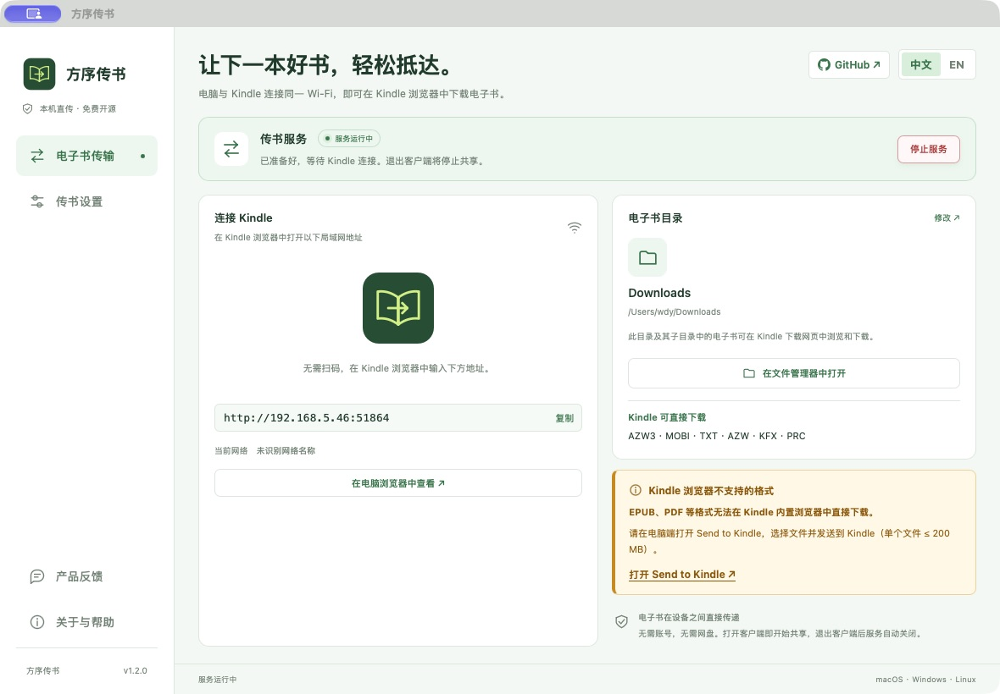
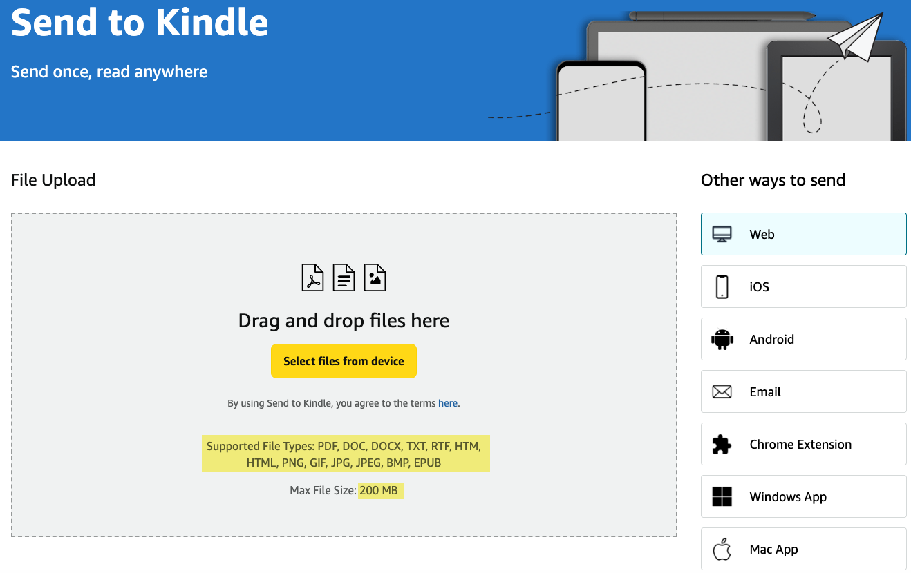
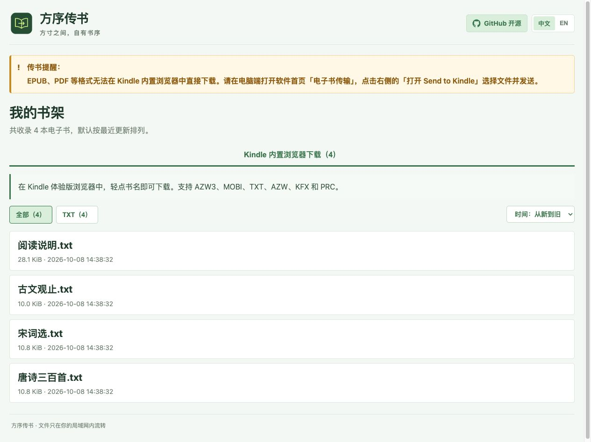
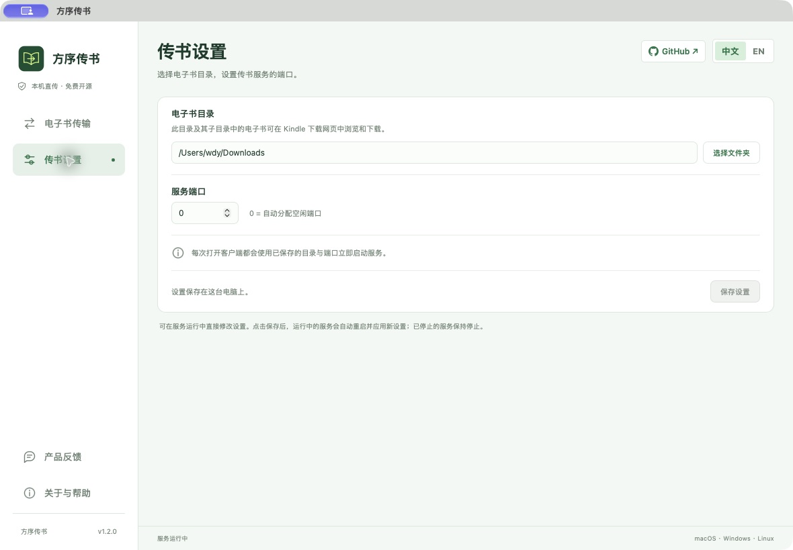
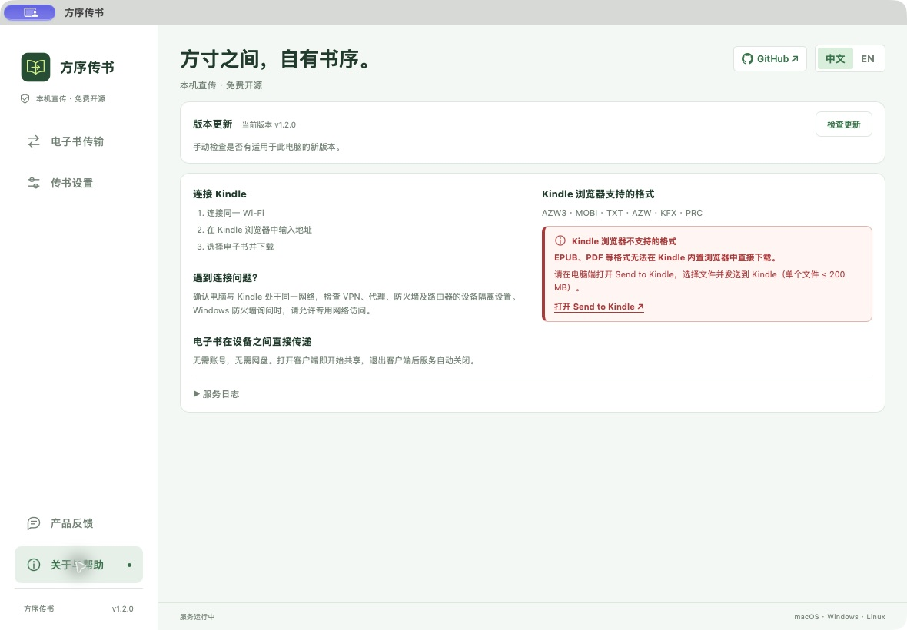

# Fangxu Kindle Transfer

[简体中文](./README.md) | **English**

[](https://go.dev/)
[](./LICENSE)
[](https://github.com/goldenwind/fangxu-kindle-transfer/actions/workflows/test.yml)
[](https://github.com/goldenwind/fangxu-kindle-transfer/releases/latest)
[](#download)
[](#download)
[](#download)

> Every book in its place, even within a small screen.

A free, open-source Kindle transfer client for macOS, Windows and Linux. No account or membership required. Download ebooks through the Kindle built-in browser over local Wi-Fi, or quickly open Amazon Send to Kindle for other formats.

Built with Tauri 2, Rust and Vite, following the desktop architecture of `fangxu-desktop-app-starter` and the sidebar and service controls of `fangxu-file-transfer`. The existing Go transfer service is bundled as a managed child process. The desktop client displays connection addresses, the folder and service status; books are browsed on the Kindle download webpage.



## Download

Get the appropriate package from [GitHub Releases](https://github.com/goldenwind/fangxu-kindle-transfer/releases):

| System | Downloads |
| --- | --- |
| macOS 12+, Apple Silicon | `.dmg` containing `aarch64` in its filename |
| macOS 12+, Intel | `.dmg` containing `x64` in its filename |
| Windows x86-64 | `.exe` installer, `.msi`, or `windows-x64-portable.zip` |
| Linux x86-64 | `.deb` / `.AppImage` containing `amd64` / `x86_64` |
| Linux ARM64 | `.deb` / `.AppImage` containing `arm64` / `aarch64` |

Starting with **v1.2.0**, releases provide native desktop installers and a Windows portable ZIP. GitHub Actions builds five OS and architecture combinations, then publishes all packages and a `SHA256SUMS.txt` checksum manifest after every build succeeds. Historical `kindle-send-*` downloads are standalone CLI builds.

**Windows portable edition:** Download the file ending in `windows-x64-portable.zip`, extract the entire archive, then double-click `Fangxu-Kindle-Transfer.exe`. Keep `fangxu-kindle-service.exe` and all other files beside it; do not run the app inside the ZIP or move only the main executable. No client installation is required. Settings remain in the system application configuration directory and are shared with the installed edition. The interface requires WebView2 Runtime, included with Windows 11 and already present on most Windows 10 devices. If missing, first install Microsoft's [Evergreen Runtime](https://developer.microsoft.com/microsoft-edge/webview2/) ([distribution details](https://learn.microsoft.com/microsoft-edge/webview2/concepts/distribution)).

The minimum macOS version matches the bundled Go 1.25 service's [system requirements](https://go.dev/doc/go1.25#darwin).

## Quick Start

1. Install and open the client, or extract the Windows portable edition and double-click the main executable. Sharing starts immediately. The first launch uses Downloads and an available port.
2. To change the folder or port, edit and save the settings in **Transfer settings**. The running service automatically restarts with the new settings.
3. Connect your Kindle and computer to the same Wi-Fi.
4. Open a displayed LAN address in the Kindle browser to download books.
5. Click **Stop service**, or close the client window when finished. Exiting stops the bundled service.

Every launch immediately starts sharing, including when an older configuration disabled automatic startup. Folder, port and language preferences are saved in the system application configuration directory. The native client starts the service during initialization, independently of page loading. The first launch follows the system language. Switch Chinese or English in the top bar at any time, including while sharing; the choice is saved immediately. Opening the app again focuses the existing window. Settings can be edited while sharing; saving restarts the running service. A stopped service stays stopped after saving. Starting applies the current settings form.

On Windows, allow private-network access when prompted by the firewall. On Linux, run `chmod +x filename.AppImage` before using an AppImage.

## Supported Formats

- **Kindle built-in browser:** `AZW3`, `MOBI`, `TXT`, `AZW`, `KFX`, `PRC`
- **Send to Kindle:** `PDF`, `DOC`, `DOCX`, `TXT`, `RTF`, `HTM`, `HTML`, `PNG`, `GIF`, `JPG`, `JPEG`, `BMP`, `EPUB`; up to 200 MB per file



Click **Open Send to Kindle** on the right of **Book transfer** or in **About & help** to open [Amazon Send to Kindle](https://www.amazon.com/sendtokindle). Open your book folder from the transfer page and select the file manually in the upload dialog.

The Kindle download webpage lists directly downloadable books with search, format filters and sorting. Follow the notice at the top to send EPUB, PDF and other unsupported formats with Send to Kindle.



> **Amazon account region:** The Kindle China eBook Store closed on June 30, 2023, and its cloud-download service ended on June 30, 2024. To use Send to Kindle, mobile transfer, or email delivery, you need to register a US Amazon account and sign in to the same account on your Kindle e-reader and Kindle app.

## Features

- Immediate service startup on every launch, native folder selection, saved settings and service start/stop controls
- Sidebar navigation for Book transfer, Transfer settings and About & help, following Fangxu File Transfer
- Check for stable updates in About & help, matched to the current version, OS and architecture, with release notes and a download link ([integration notes](docs/updates.md))
- Closing the client stops sharing; repeated launches focus the existing window
- Recursive folder scanning on the Kindle download webpage, with search, format filters and file counts
- Four sorting options on the webpage: newest first (default), oldest first, name ascending, and name descending
- Chinese and English interface with instant switching and saved preferences, including status, notices and service logs
- [Product feedback](https://api.ip21.cn/products/11/feedback) opens inside the desktop client for questions and suggestions; sign-in is only required for feedback. Local transfer requires no account ([integration notes](docs/feedback.md)).
- Random available port and single-instance behavior
- Native desktop interface with the existing Kindle download webpage
- Direct transfers remain on the local network





## ☕ Support and Follow

Fangxu Kindle Transfer will remain free and open source. If it saves you time, consider buying the author a coffee, starring the project, or sharing it with another Kindle reader.

<table>
  <tr>
    <td align="center" width="33%"><strong>Alipay</strong><br><br></td>
    <td align="center" width="33%"><strong>WeChat Pay</strong><br><br></td>
    <td align="center" width="33%"><strong>Follow Yideng AI</strong><br><br></td>
  </tr>
</table>

## Development and Packaging

Requires Go 1.22+ (Go 1.25 for releases), Node.js 20.19+ or 22.12+, Rust stable and the [Tauri prerequisites](https://v2.tauri.app/start/prerequisites/).

```bash
npm ci
npm run desktop:dev       # Builds the Go sidecar and starts the desktop client
npm run check             # Go, frontend and Rust protocol checks
npm run desktop:build     # Builds installers for the current platform
npm run desktop:portable  # On Windows, builds the x64 portable ZIP (requires PowerShell 7 / pwsh)
```

Before releasing, update the application version in `package.json`, `package-lock.json`, `src-tauri/tauri.conf.json`, `src-tauri/Cargo.toml` and `src-tauri/Cargo.lock`. Run `npm run check:version -- v1.2.0` and `npm run check`, commit the changes, then push the matching tag:

```bash
git tag -a v1.2.0 -m "Fangxu Kindle Transfer v1.2.0"
git push origin main
git push origin v1.2.0
```

The tag triggers [Desktop release](https://github.com/goldenwind/fangxu-kindle-transfer/actions/workflows/release.yml). To retry, run that workflow manually in Actions with the existing tag. The workflow verifies that the tag matches the application version and caches Rust build outputs.

Installers are generated in `src-tauri/target/release/bundle/`. Install the appropriate Rust target before building another architecture, for example `npm run desktop:build -- --target x86_64-apple-darwin`. The build script compiles and bundles the matching Go service automatically. End users do not need Go, Node or Rust installed.

The Windows portable ZIP is generated in `src-tauri/target/x86_64-pc-windows-msvc/release/bundle/portable/`. With an existing release build for that target, run `npm run package:windows-portable` to package it separately. The release workflow reuses the installer build outputs and uploads the ZIP to the same Release.

The interface uses a light green theme. In-app logos, Dock icons, and installer icons share `docs/app-icon.svg` and retain the dark green background and light green strokes of the brand. Builds automatically regenerate platform icons with `npm run build:icons` after logo changes.

`npm run dev` previews only the interface. Use `desktop:dev` for service controls. Settings live in Tauri's `app_config_dir()/settings.json` (on macOS: `~/Library/Application Support/com.fangxu.kindle-transfer/settings.json`).

The client controls Go through inherited stdin/stdout pipes, never a LAN control API. Closing the pipe stops sharing. Web settings and shutdown controls are disabled for desktop-managed services. CLI and desktop services share an instance lock; stop an existing CLI service before starting sharing in the client.

## Command Line

Run from source with Go 1.22 or newer:

```bash
go run . --dir "/path/to/your/ebooks"
```

Common options:

```text
--dir PATH                Set the ebook directory
--listen 0.0.0.0:9000    Use a fixed port
--no-open                 Do not open the browser at startup
```

Without `--dir`, the application uses the current user's Downloads folder. By default it listens on `0.0.0.0:0`, allowing the operating system to select an available port.

## Mobile Transfer Notes

You can also send ebooks to your Kindle using the Kindle app on an Android phone, iPhone, or iPad:

1. Download and install the Kindle app:
   - iPhone / iPad: [App Store](https://apps.apple.com/us/app/amazon-kindle-reading-app/id302584613)
   - Android: [Google Play](https://play.google.com/store/apps/details?id=com.amazon.kindle&hl=en_US) or [APKMirror](https://www.apkmirror.com/apk/amazon-mobile-llc/amazon-kindle/)
2. Find the ebook in your device's file manager or another app, tap **Share**, and select **Kindle**.
3. Sign in to the Kindle app and your Kindle e-reader with the same Amazon account, using the same regional marketplace.
4. Wait for the library to sync, then find and download the book on your Kindle.

## Transfer by Email

Each Kindle has a dedicated Send to Kindle email address that can receive ebooks into your Kindle Library:

1. Sign in to the US Amazon [Manage Your Content and Devices](https://www.amazon.com/mycd) page, then open **Personal Document Settings** under **Preferences**.
2. Find the target device's address under **Send-to-Kindle E-Mail Settings**.
3. Add the email address you will send from to the **Approved Personal Document E-mail List**. Messages from other addresses will not be accepted.
4. Create an email, attach the ebook, and send it to the Kindle address. The subject and message body can be left blank.
5. Connect the Kindle to the internet and sync it, then find and download the ebook from your library.

An email can contain up to 25 attachments with a combined size of no more than 50 MB. Files must use one of the Send to Kindle formats listed above.

## Security

- The service has no authentication. Use it temporarily on a trusted home network only.
- Keep the application running while transferring books, then stop it from the client or close its window. Standalone CLI builds still support the browser control page.
- Send to Kindle requires an Amazon account linked to your Kindle and uploads files to Amazon.

## License

Open source under the [MIT License](./LICENSE). Issues, feature requests, and pull requests are welcome.
